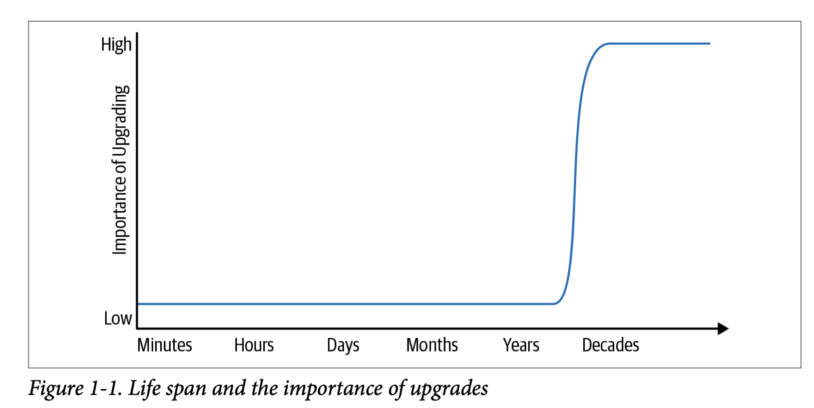

## What is software engineering
<br>
diffrences between software engineering and programming: 

- time
- scale
- tradeoff

```Software engineering is programming integrated over time```

### Time

Expected lifespan of code varies greatly. Underlying library, OS, language version all changes over time.  This requires our program to be ```sustainable```.<br>

A project is ```sustainble``` if it is capable of reacting to whatever valuable change comes along, for either technical or business reasons.

Not sustainable --> Risk

### Scale

A programming task is often an individual creation, but a software engineering task is a team effort.

```Team collaboration``` presents new problems, but also provides more potential to produce valuable system than single programmer could.

problems: organisation growth, communication issue, human scaling, version control and testing strategies.


### Tradeoff
No one-size-fits-all solution for all software engineering problems. We sometimes need to choose an imperfect solution as long as they are justified

complexity of decisions + Imperfect metrics --> tradeoffs

## Time and Change

Lifespan of codes varies from a few days to decades to even effecively unbounded lifespan. programming assignments vs industry code vs Linux kernel/ HTTP server

Short-lived code is also common in industry settings (for early-stage startyps, they may not live long enough to reap the benefit of an infrastructure investment that pays off slowly)





### Reading list:

The Mythical Man-Month

[No Silver Bullet](http://worrydream.com/refs/Brooks-NoSilverBullet.pdf)